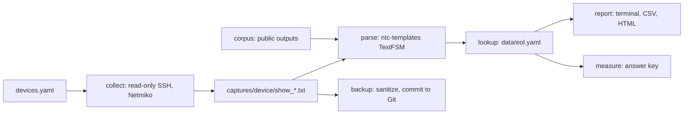

# catalyst-lifecycle

Inventories Cisco Catalyst switches over read-only SSH, backs up their configs to Git, and flags every part past Cisco end-of-support with the Catalyst 9400 part that replaces it.

**Result:** on 60 parts from public Catalyst 4500 and 9400 outputs, following Cisco's replacement chains across notices cut replacement suggestions that were themselves end-of-life from 10 to 0, and the status of every part matched the answer key (60/60, up from 57/60).

**Stack:** Python, Netmiko, TextFSM (ntc-templates), Git, pytest, GitHub Actions

[](https://github.com/mumer-net/catalyst-lifecycle/actions/workflows/ci.yml)


## Why I built this

I am a technical intern in Network, Systems & Security at Connecticut College. The Catalyst 4500 was a common campus switch for years, and Cisco's last date of support for most 4500 parts was October 31, 2025. I wanted a tool that reads what is actually in a switch, checks each part against Cisco's end-of-life notices, and says what to order instead. I built and tested it on a Cisco DevNet sandbox and on public sample outputs, not on campus equipment.

## Results

| What | v0.1: exact part number, one hop | v0.2: suffixes and chains | How it's measured |
| --- | --- | --- | --- |
| Parts with the right status | 57/60 | 60/60 | `catalyst-lifecycle measure` against [corpus/answer_key.csv](corpus/answer_key.csv) |
| Replacements that match the key | 19/29 | 29/29 | Same run |
| Replacements that are end-of-life too | 10 | 0 | Same run |

| Check | Result | How it's measured |
| --- | --- | --- |
| Report on the 32-part 4507R+E inventory | 0.15 s | `time catalyst-lifecycle report corpus/genie-c4507re-vss`, middle of 3 runs |
| DevNet Catalyst 8000V sandbox | 0 of 3 parts flagged | `catalyst-lifecycle collect`, then `report captures` |

Raw results are in [results/](results/).

## How it works



The end-of-life table, [data/eol.yaml](data/eol.yaml), is copied from 13 of Cisco's public notices. Each notice keeps its URL and dates, and each part maps to the replacement the notice names. Cisco's EoX API would do this, but it only works for support-contract customers and partners.

Most notices don't name a Catalyst 9400 part. They name another 4500 part, and even the 9400 parts some of them name were retired later. So the tool follows each replacement until it reaches a part with no end-of-life notice:

| In the switch | The first notice says | Then | Order today |
| --- | --- | --- | --- |
| WS-X45-SUP8-E | C9400-SUP-1XL (EOL13217) | End of sale April 30, 2025 (EOL15392) | C9400X-SUP-2XL |
| WS-X45-SUP7-E | WS-X45-SUP8-E (EOL11264) | C9400-SUP-1XL, then end of sale | C9400X-SUP-2XL |
| WS-X4648-RJ45V+E | WS-X4748-RJ45V+E (EOL10936) | Support ended October 31, 2025 (EOL13217) | C9400-LC-48P |
| WS-C4507R | WS-C4507R-E (EOL6869) | WS-C4507R+E (EOL8168), then C9407R (EOL13217) | C9407R |

A few design choices:

- The tool only reads. Every command goes through an allowlist of three `show` commands, and a test fails the build if any source file contains a Netmiko configuration call.
- Live runs save raw output in the same folder layout as the public samples in [corpus/](corpus/), so the report and the measurement go through the same parser.
- Status depends on a date: past support, end of sale, announced, or not listed. A part with no notice is reported as not listed, never as supported. I found no Cisco notice for the 4507's mux buffers (WS-X4590-EX), so they stay not listed.
- Cisco writes spares as `=`, TAA spares as `++=`, and redundant units as `/2`. Some fan trays are only listed as spares, and some devices report the `=` themselves, so lookups ignore those suffixes.
- Where a notice lists two replacements, the table keeps the first and a comment names the other.
- Backups drop the lines that change on every read (byte counts, timestamps, `ntp clock-period`), mask passwords, keys, and SNMP communities, and commit only when the config changed. The backup repo stays on my machine.
- ntc-templates keeps the padding after VID in `show inventory` (`V00  `), so the parser strips every field. It has no `cisco_xe` templates, so IOS XE output is parsed with the `cisco_ios` ones.

## How to run

```bash
git clone https://github.com/mumer-net/catalyst-lifecycle && cd catalyst-lifecycle
uv sync
make test                                                   # lint, then 39 tests
uv run catalyst-lifecycle report corpus --html reports/corpus.html
uv run catalyst-lifecycle measure                           # both lookups against the answer key
cp .env.example .env                                        # then add the sandbox credentials
uv run catalyst-lifecycle collect                           # read-only SSH to the devices in devices.yaml
uv run catalyst-lifecycle report captures --csv reports/devnet.csv
uv run catalyst-lifecycle backup                            # commits to ~/config-backups
```

## Method

- Corpus: 8 public outputs (`show inventory`, `show module`, and `show version`) from the test data of genieparser and ntc-templates, 60 parts in all. [corpus/SOURCES.md](corpus/SOURCES.md) lists where each one came from.
- Answer key: for each part, its status on September 30, 2026 and the part to order, read off Cisco's notices. Each row names the notices it comes from. The table and the key were checked against the live notice pages on October 5, 2026.
- `measure` scores both lookups on every run. The v0.1 lookup matches the exact part number and stops at the first replacement. A test checks that it still gives the numbers committed in results/v0.1.json.
- A replacement counts as end-of-life when the table has a notice for it on the key's date.
- The measurement uses the key's date, not today's, so the numbers don't change as days pass.
- The sandbox result in results/devnet.csv leaves out serial numbers, because the sandbox is shared.

## Tests

39 pytest tests run in GitHub Actions on every push. They cover the table (dates, duplicates, loops), status on each side of every milestone, replacement chains, parsing of every sample, the CSV and HTML reports, config sanitizing and Git backups in a temporary repo, collection against a fake SSH connection, the read-only allowlist, and the answer key.

## What I'd do next

- Check that replacements fit together. The tool maps one part to one part. It doesn't check power budgets or slot counts, or that a 9400 line card works with the supervisor it picked.
- Add the Catalyst 4500-X, whose replacements are Catalyst 9500 switches.
- Compare the running IOS XE release with Cisco's software end-of-life notices.
- Run collection on a schedule, and in parallel, so a part crossing a date shows up without anyone asking.

## Build notes

- Goal: turn Cisco's end-of-life notices into something a script can check, and measure how often the naive lookup recommends a part Cisco no longer sells.
- Built in two releases. v0.1 has collection, parsing, the table, reports, Git backups, and the answer key with the baseline. v0.2 adds spare suffixes and replacement chains.
- On my first SSH to the sandbox I saw the padding after VID in `show inventory` by hand, before any parser touched it.
- The first v0.1 report told me to order a WS-X45-SUP8-E and a WS-C4507R-E, parts Cisco stopped selling years ago. That is the weakness v0.2 fixes, and I saw it before I measured it.
- My DevNet account only allows one active sandbox, so everything live ran on the Catalyst 8000V. To test a device that is down, I added a second device at 192.0.2.1, an address nobody answers on. The 8000V still saved, the dead one failed with "TCP connection to device failed." after about 20 seconds, and the run exited with code 1.
- For the backup drill I added a loopback by hand on the shared sandbox, backed up, removed it, and backed up again. The backup repo shows three commits: the first backup, 4 lines added, and 4 lines removed. The device added `no ip address` to my loopback on its own.
- A bug I hit: with credentials missing, the collect error printed the device name twice. The name came from both the exception and the command that printed it. It now comes from one place.
- I added masking for SNMPv3 user passwords, AAA `server-private` keys, and VPN keyring pre-shared keys, which the first version of the backup missed.
- My notes from the drills are in [docs/drills.md](docs/drills.md).

## License

MIT. The sample outputs in [corpus/](corpus/) come from genieparser and ntc-templates under the Apache License 2.0; see [corpus/SOURCES.md](corpus/SOURCES.md).
